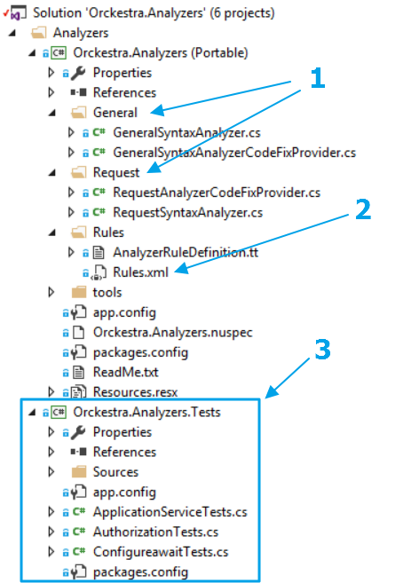
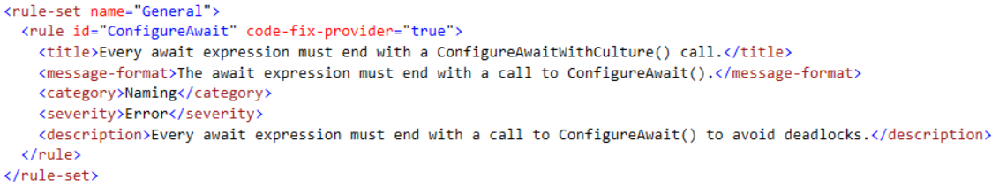

# Orckestra Analysers
## Definition
This solution contains the various analysers that are being used to validate coding and API conventions at compile time using the Roslyn compiler.
## Analysers
The solutions contains the following analysers:

* __TestCategory Mandatory__ [All unit tests are required to have a valid TestCategory attribute.]
* __Asynchronous tests must return a Task__ [Asynchronous unit tests must use the signature async Task.]
* __DataSource mandatory for client integration tests__ [All test methods marked with a TestCategory Integration and that is declared in a class inheriting from ClientIntegrationTestBase must declare a dataSource attribute.]
* __Asynchronous tests must declare an Async attribute__ [Asynchronous test methods should declare an Async TestCategory.]
* __Await expressions must call ConfigureAwaitWithCulture__ [Every await expression must end with a call to ConfigureAwait() to avoid deadlocks.]
* ... and many more.

To get the full list of analyzers, look for the file rules.xml in each analyzer project. This file contains all analyzer with their respective description.

## Installation
Building this project will produce an analyzer .dll, as well as a NuGet package (.nupkg file) that will add your assembly as a project-local analyzer that participates in builds.

## Structure Of An Analyzer
A typical analyzer is composed of three parts: the analyzer itself, the code fix provider and unit tests.
Writing an analyzer is a perfect way of experiencing TDD(Test Driven Development) as you would first write some
code that would raise one or more diagnostic issues. You execute the test and make sure that it fails since you have no analyzer
that wold trigger the diagnostic issues so far. You then write your analyzer and debug it until the test finally
passes. Once the analyzer is written, you write a file that correspond to the source file after a code fix was successfully
applied to it. Run and make sure it fails. Now, write your code fix provider and debug until the test finally passes.
> If this is your first time writing code that uses the Roslyn API, you might find it a little hard to understand at first.
> But, don't worry as there are plenty of samples all over the web. 

In the following image, you can see where you put your analyzer and code fix provider code (1), where you define your rules (2) and finally
where you put your unit tests (3). I will now walk you through the creation of an analyzer.

### 1 - Creation Of a Rule
The first step when creating an analyzer is to create a rule that will define what you are trying to detect and notify. So, in the _Orckestra.Analyzers_ project, under the
Rules folder, open the rules.xml document. You can see that the root element is _rules_ and that it contains _rule-set_ elements. These elements
are containers for rules targetting the same syntax issues. Under the _rule-set_ element, you will find one or more _rule_ elements. 

These elements describe the actual diagnostic you are trying to create. Each rule has the following element:

* __id__ _(attribute,mandatory)_: The name of the diagnostic. It will be used to create your diagnostic partial class.
* __code-fix-provider__ _(attribute,boolean,optional)_: Specifies if the diagnostic will provide a code fix. Default: false.
* __title__ _(element,string,mandatory)_: The title of your diagnostic. Should be short and descriptive.
* __message-format__ _(element,string,mandatory)_: The message that will be displayed to the developer when the diagnostic is triggered in a code file. It may contain {n} elements that can be filled at runtime with additional info.
* __category__ _(element,string,mandatory)_: The category of he diagnostic.
* __severity__ _(element,enum,optional)_: The severity of the rule. Can be one of the following values: Error, Warning, Info, Hidden. [More information](http://www.coderesx.com/roslyn/html/1098AFA2.htm)

Once the rule has been added, you may now right-click on the _AnalyzerRulDefinition.tt_ file and select '__Run Custom Tool__'. Once the tool ran 
successfully, the generated AnalyzerRuleDefinition.cs will contain all the boilerplate code that you need to create your analyzer. Go take a look at the generated but 
it only contains static declarations filled with the data found in the Rules.xml file.

### 2- Implementation Of a Rule

Now, the fun part. Once the boilerplate code has been generated, you will have to create one or two partial classes for your diagnostic.
The first one will hold the code that will raise the diagnostic and the second will contain code that can provide a code fix for the previously
detected diagnostic. In the project Orckestra.Analyzers, under the folder that has the same name as the rule-set element containing your new rule,
make sure the counterpart classes are present. Otherwise, create them and make sure yo respect the namespaces for the partial classes.

In the partial class for your diagnostic detection, there is only one important method: public override void Initialize(AnalysisContext context). This is where you
register your syntax node actions. I will not go through the registration of syntax node actions here but [here is a document](https://github.com/dotnet/roslyn/blob/master/docs/analyzers/Analyzer%20Actions%20Semantics.md)
that shoud get you started.

### 3- Debugging a Diagnostic

...to be continued.

## TRYING OUT YOUR NUGET PACKAGE

To try out the NuGet package:
 1. Create a local NuGet feed by following the instructions here:
    > [Hosting your own nuget feeds](http://docs.nuget.org/docs/creating-packages/hosting-your-own-nuget-feeds)
 2. Copy the .nupkg file into that folder.
 3. Open the target project in Visual Studio 2015.
 4. Right-click on the project node in Solution Explorer and choose Manage
    NuGet Packages.
 5. Select the NuGet feed you created on the left.
 6. Choose your analyzer from the list and click Install.

If you want to automatically deploy the .nupkg file to the local feed folder
when you build this project, follow these steps:
 1. Right-click on this project in Solution Explorer and choose 'Unload Project'.
 2. Right-click on this project and click "Edit".
 3. Scroll down to the "AfterBuild" target.
 4. In the "Exec" task, change the value inside "Command" after the -OutputDirectory
    path to point to your local NuGet feed folder.
	
## Authors
* [Stephane Larocque](mailto:stephl001@gmail.com)
